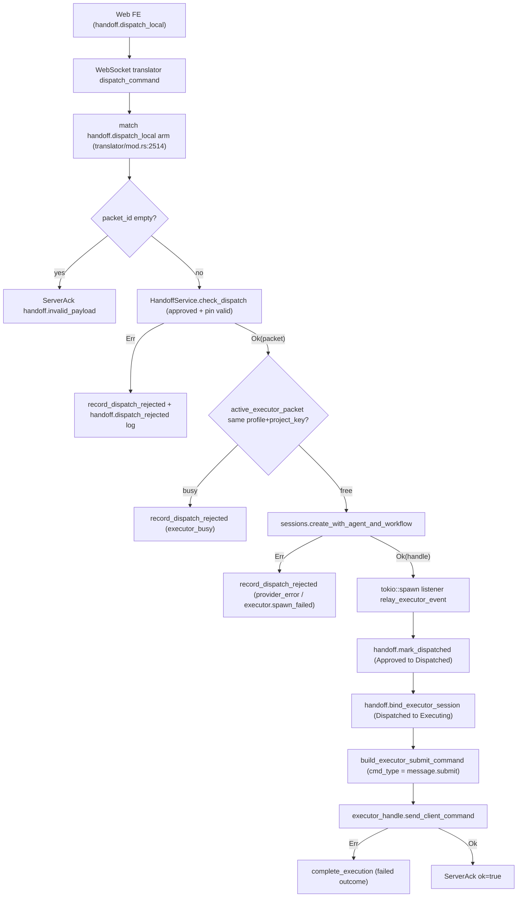
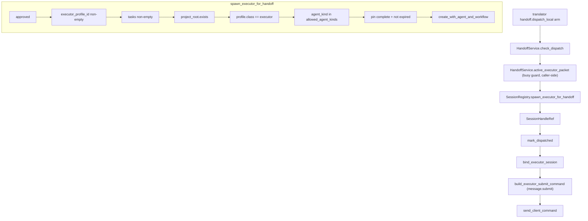

# Executor Implementation Wiring Plan (Pass E1 + E2)

**Handoff:** Executor Implementation (Pass E1 + E2)
**Author:** vac-web automation (Pass E1 audit)
**Repo HEAD at audit:** `1322941e43810bb8d07058a6971e59241703365d` (branch `main`)
**Validation:** `cargo test -p mock-engine` → 47/47 pass, 0 warnings.

---

## 1. Goal

Document the **current** wiring of the `handoff.dispatch_local` →
`message.submit` executor flow (Phase E1) and define the **target shape** for
Phase E2 — extracting `spawn_executor_for_handoff` as a single, testable entry
point so that translator-side dispatch becomes a thin orchestration layer.

Invariant under audit:
`handoff_dispatch_to_acp_uses_message_submit_not_handoff_dispatch_local` —
the runtime dispatch mechanism into the executor session **must** be
`message.submit` carrying `handoff_packet_id`, never `handoff.dispatch_local`.

---

## 2. Phase E1 — Current-state checks

Legend: ✅ = present and correct, ⚠ = present but inlined / scattered,
❌ = missing.

| # | Check | Location | Status | Notes |
|---|---|---|---|---|
| 1 | Translator handler for `handoff.dispatch_local` exists | `apps/local-bridge/src/translator/mod.rs:2514` | ✅ | Single match arm orchestrates the full dispatch path. |
| 2 | `packet_id` extracted + empty-id guard | `translator/mod.rs:~2535` | ✅ | Empty string treated as absent (`handoff.invalid_payload`). |
| 3 | `HandoffService::check_dispatch(packet_id, project_root, now)` | `apps/local-bridge/src/handoff/mod.rs` (validate packet, pin, expiry) | ✅ | Returns `Result<Packet, DispatchError>`; sole gate for status=Approved + pin freshness. |
| 4 | Busy guard via `active_executor_packet(executor_profile_id, project_key)` | `translator/mod.rs:2561`, impl `handoff/registry.rs:61`, facade `handoff/mod.rs:54` | ✅ | Project key = `{repo_ref}::{base_commit_sha}` (see `project_key_for_packet`). |
| 5 | `record_dispatch_rejected` on busy / spawn-fail / state-error | `translator/mod.rs:~2575, ~2640, ~2710` | ✅ | Emits `handoff.upserted` + `handoff.status` events; structured log via `StructuredLogBuilder`. |
| 6 | Executor session spawn | `translator/mod.rs:~2660` → `SessionRegistry::create_with_agent_and_workflow(profile_id, project_root, None, None)` | ⚠ | Inlined inside translator arm; no dedicated function for handoff context. |
| 7 | Executor → source event relay listener | `translator/mod.rs:~2685` (`tokio::spawn` over `executor_handle.broadcast.subscribe()`) | ⚠ | Relay loop inlined; calls `relay_executor_event`. |
| 8 | `mark_dispatched` (state machine: Approved → Dispatched) | `translator/mod.rs:~2735`, impl `handoff/mod.rs` | ✅ | |
| 9 | `bind_executor_session` (state machine: Dispatched → Executing, attaches `execution_session_id`) | `translator/mod.rs:~2811`, impl `handoff/mod.rs:1100` | ✅ | Function name in code is `bind_executor_session` (not `bind_execution_session`). |
| 10 | `build_executor_submit_command` → `send_client_command` (= `message.submit`) | `translator/mod.rs:~2835`, prompt builder at `handoff::build_executor_initial_prompt` | ✅ | Carries `handoff_packet_id`, `source_session_id`, `text`. |
| 11 | Failure compensation: on `send_client_command` error, packet completes with `failed` outcome | `translator/mod.rs:~2860` (`HandoffExecutionCompleteOutcome`) | ✅ | All packet tasks marked failed; terminal event emitted. |
| 12 | Capability profile `executor.code@1.0.0` exists | `packages/protocol/v1/profiles/executor.code@1.0.0.yaml` | ✅ | `class: executor`, `allowed_agent_kinds: [mock, vac-native, acp]`. |
| 13 | Profile loader + agent-kind enforcement | `packages/profile-core` (`CapabilityProfile::load`, `enforce_agent_kind`); used by `SessionRegistry::resume_native` | ✅ | Pattern available; not yet invoked by handoff dispatch path (current path uses `create_with_agent_and_workflow` which does its own profile load but does **not** explicitly assert `class == executor` for handoff context). |
| 14 | Invariant test `handoff_dispatch_to_acp_uses_message_submit_not_handoff_dispatch_local` | `translator/mod.rs:4822` | ✅ | Asserts `cmd.cmd_type == "message.submit"`. |
| 15 | `cargo test -p mock-engine` clean | (run during E1) | ✅ | 47 tests, 0 failed, 0 warnings. |
| 16 | Dedicated `spawn_executor_for_handoff` function | (none) | ❌ | E2 deliverable. Logic currently inlined in translator arm (rows 6, 7). |
| 17 | `ExecutorSpawnError` enum | (none) | ❌ | E2 deliverable. |
| 18 | Handoff dispatch tests at integration layer | `apps/local-bridge/tests/*` | ❌ | No `tests/handoff_dispatch.rs` file; no `dispatch_*` test names found. E2 must add 4 tests. |

---

## 3. Current flow (Phase E1)



**Key finding:** the Phase E1 arm is functionally complete but the spawn +
validation logic is inlined (~370 lines inside one match arm). All critical
state machine transitions (`mark_dispatched`, `bind_executor_session`) and
the runtime dispatch (`message.submit` via `send_client_command`) are present
and correct. The E2 task is **extraction + explicit validation**, not a
rewrite.

---

## 4. Phase E2 — Target shape

### 4.1 New function

```rust
// apps/local-bridge/src/session/registry.rs

pub async fn spawn_executor_for_handoff(
    &self,
    packet: &Packet,
    project_root: PathBuf,
    agent_id: Option<String>,
) -> Result<SessionHandleRef, ExecutorSpawnError>
```

Validation gates **inside** the function (in order):

1. `packet.status == PacketStatus::Approved` → else `ExecutorSpawnError::NotApproved { actual }`.
2. `!packet.target.executor_profile_id.is_empty()` (treat empty string as absent) → else `MissingExecutorProfile`.
3. `!packet.tasks.is_empty()` → else `EmptyTaskList`.
4. `project_root.exists()` (mirror `resume_native` pattern) → else `ProjectRootMissing`.
5. Load `CapabilityProfile::load(profile_id, profile_root)`; assert `profile.class == ProfileClass::Executor` → else `ProfileNotExecutor { actual_class }`.
6. If `agent_id` is `Some(id)` and not empty: lookup in `AgentRuntimeRegistry`; resolve `agent_kind` and assert it is in `profile.allowed_agent_kinds` via `enforce_agent_kind` → else `AgentKindNotAllowed { agent_kind, allowed }`.
7. `packet.pin.is_complete() && !packet.pin.is_expired()` → else `PinInvalid { reason }`.
   - Note: pin freshness is also enforced upstream by `HandoffService::check_dispatch`. Re-checking here makes the function safe to call directly from tests without going through the full translator path.
8. Active-executor busy guard — **caller responsibility** (translator already calls `HandoffService::active_executor_packet` before invoking this function). Documented in the function rustdoc; not re-validated here because `HandoffService` is not in `SessionRegistry`'s scope.
   - Decision: keep busy guard in caller to preserve `SessionRegistry` single-responsibility shape.
9. Spawn via existing `self.create_with_agent_and_workflow(profile_id, project_root, agent_id, None)`; map any error to `ExecutorSpawnError::SpawnFailed { detail }`.

Return the `SessionHandleRef` on success. The caller (translator) is
responsible for `mark_dispatched`, `bind_executor_session`, listener spawn,
and `message.submit` dispatch — none of those move into
`spawn_executor_for_handoff`, because they are concerns of the translator's
orchestration layer, not the spawn primitive.

### 4.2 `ExecutorSpawnError` enum

```rust
#[derive(Debug, thiserror::Error)]
pub enum ExecutorSpawnError {
    #[error("packet not approved (status={actual})")]
    NotApproved { actual: String },
    #[error("target.executor_profile_id is required")]
    MissingExecutorProfile,
    #[error("packet.tasks must be non-empty")]
    EmptyTaskList,
    #[error("project_root does not exist: {path}")]
    ProjectRootMissing { path: String },
    #[error("profile {profile_id} has class={actual_class}, expected executor")]
    ProfileNotExecutor { profile_id: String, actual_class: String },
    #[error("agent_kind {agent_kind} not in profile.allowed_agent_kinds {allowed:?}")]
    AgentKindNotAllowed { agent_kind: String, allowed: Vec<String> },
    #[error("pin invalid: {reason}")]
    PinInvalid { reason: String },
    #[error("spawn failed: {detail}")]
    SpawnFailed { detail: String },
}
```

### 4.3 Translator wiring change

Replace the inlined `sessions.create_with_agent_and_workflow(...)` block in
the `handoff.dispatch_local` arm with:

```rust
let executor_handle = match state
    .sessions
    .spawn_executor_for_handoff(&packet, project_root.clone(), None)
    .await
{
    Ok(handle) => handle,
    Err(err) => {
        // map ExecutorSpawnError to reason_tag and call record_dispatch_rejected,
        // same shape as today (executor.spawn_failed / provider_error etc.)
        ...
    }
};
```

All downstream steps (listener spawn, `mark_dispatched`,
`bind_executor_session`, `build_executor_submit_command`,
`send_client_command`, failure compensation) stay unchanged — preserving the
`message.submit` invariant.

### 4.4 Target flow (Phase E2)



---

## 5. Touched paths for Pass E2

| Path | Change |
|---|---|
| `apps/local-bridge/src/session/registry.rs` | Add `spawn_executor_for_handoff`; add `pub use ExecutorSpawnError`. |
| `apps/local-bridge/src/session/mod.rs` | Re-export `ExecutorSpawnError` from `registry`. |
| `apps/local-bridge/src/translator/mod.rs` | Replace inlined spawn block in `handoff.dispatch_local` arm (line ~2660) with call to `spawn_executor_for_handoff`; map `ExecutorSpawnError` variants to existing `record_dispatch_rejected` reason tags. |
| `apps/local-bridge/tests/handoff_dispatch.rs` (NEW) | Add 4 tests: `dispatch_spawns_executor_session_for_approved_packet`, `dispatch_rejects_non_approved_packet`, `dispatch_rejects_executor_busy`, `dispatch_rejects_pin_drift_strict`. |
| `docs/plans/wiring/executor-implementation-plan.md` | This audit doc (Pass E1 deliverable). |

**Out of scope (E1/E2):** changes to ACP runtime, executor profile YAML
schema, persistence layer, or any web/FE code. No new YAML primitives, no
modifications to `.git/config`, no edits to `.env*` or `**/secrets/**`. No
`git push` / `git tag`.

---

## 6. Validation gate (run at end of Pass E2)

1. `cargo test -p mock-engine` (smoke; already green at E1).
2. `cargo test -p local-bridge --lib` (unit tests including translator inline `mod tests`).
3. `cargo test -p local-bridge handoff` (filtered: hits the new `handoff_dispatch.rs` integration tests).
4. `cargo fmt --all -- --check`.
5. `git diff --check` (whitespace + conflict markers).

No step requires network egress or modifies the working tree outside
`touches_paths`.

---

## 7. Notes / risks

- **Function placement debate:** `spawn_executor_for_handoff` could live on `HandoffService` instead of `SessionRegistry`. Chosen `SessionRegistry` because the **primary** outcome is a session handle and the function's hot path is `create_with_agent_and_workflow`. This keeps `HandoffService` focused on packet state machine semantics and avoids a circular dependency (`HandoffService` would otherwise need to hold a session-spawning capability).
- **Empty-string IDs:** Treated as absent in all validations (matches existing translator behavior for `packet_id`).
- **`agent_id == None` path:** When the caller passes `None`, agent-kind enforcement is skipped (mirrors current `create_with_agent_and_workflow` semantics where the runtime resolves a default agent for the profile).
- **Test convention:** existing integration tests live at `apps/local-bridge/tests/*.rs` and instantiate `HandoffService::new()` plus a state harness (e.g., `session_lifecycle.rs:48`, `acp_driver.rs:162`). The new `handoff_dispatch.rs` will follow the same pattern.
- **Invariant guard:** `handoff_dispatch_to_acp_uses_message_submit_not_handoff_dispatch_local` remains in `translator/mod.rs:4822` and is **not** modified. It will continue to enforce that `build_executor_submit_command` produces `cmd_type == "message.submit"`.
